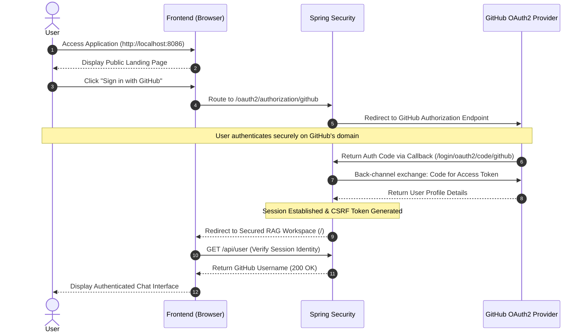
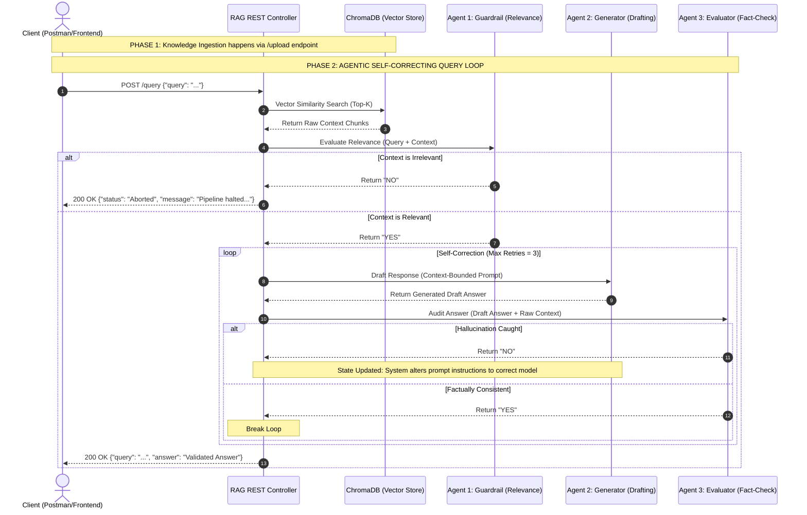

# Self-Correcting RAG Pipeline with Spring AI & Ollama

A production-grade, agentic **Retrieval-Augmented Generation (RAG)** pipeline built using modern Java with **Spring Boot 3.x**, **Spring AI**, and a local **Ollama** LLM instance. This architecture elevates standard RAG patterns by introducing an autonomous orchestration layer featuring **Guardrail** and **Evaluator** agents that programmatically check for relevance, mitigate hallucinations, and ensure strict factual consistency.

---

## 🏗️ System Architecture & Workflow

## 🔐 Security & Authentication (GitHub OAuth2)

To ensure the RAG workspace remains secure and access-controlled, the application integrates **Spring Security** with **GitHub OAuth2** for seamless, passwordless authentication.

Unauthenticated users are greeted by a minimalistic public landing page. Upon clicking the login trigger, the system initiates the OAuth 2.0 authorization code flow. Once authenticated, Spring Security establishes a secure session (with CSRF protection enabled for the SPA) and seamlessly transitions the UI into the private RAG chat workspace.

### Authentication Workflow


Standard RAG architectures blindly trust whatever context is retrieved from a vector database, often leading to off-topic answers or hallucinations. This system introduces an intelligent, multi-agent validation loop to enforce data reliability before an answer ever reaches the client.




### 🧠 Agentic Layer Breakdown
* **Guardrail Agent (Relevance Check):** Intercepts out-of-domain or malicious prompts. If the context retrieved from the database cannot truthfully answer the user's question, the pipeline is immediately halted to stop the model from making up information.
* **Generator Agent (Contextual Adaptation):** Focuses the LLM (`gemma4:e4b`) entirely on the retrieved data window to synthesize a clean response.
* **Evaluator Agent (Anti-Hallucination Loop):** Acts as a strict gatekeeper by evaluating the generated answer against the raw ground-truth source blocks. If it detects outside knowledge or hallucinations, it updates the state, alters the system prompt instructions, and forces a recalculation up to a maximum of 3 times.

---

## 🛠️ Tech Stack & Prerequisites

| Technology | Purpose | Version |
| :--- | :--- | :--- |
| **Java** | Core Programming Language | 17+ |
| **Spring Boot** | Enterprise Application Framework | 3.5.x |
| **Spring AI** | Fluent AI/LLM & Vector Database Orchestration | 1.1.6 |
| **Ollama** | Local LLM & Embedding Inference Engine | Latest |
| **ChromaDB** | Vector Database Storage | Latest |
| **Docker / WSL2** | Isolated Infrastructure Management | Latest |

---

## 📦 Local Infrastructure Setup

### 1. Model Pulling (Ollama)
Ensure your local Ollama instance is active and pull both the embedding model and generation model:

```bash
# Pull the generation model
ollama pull gemma4:e4b

# Pull the semantic text embedding model
ollama pull nomic-embed-text

# Verify local models are ready
ollama list
```
---

## ⚙️ Project Configuration (`application.yml`)

Configure your `src/main/resources/application.yml` file to securely bind the Spring AI framework auto-configurations to your local infrastructure services:

```yaml
spring:
  security:
    oauth2:
      client:
        registration:
          github:
            client-id: YOUR_GITHUB_CLIENT_ID
            client-secret: YOUR_GITHUB_CLIENT_SECRET
  ai:
    ollama:
      base-url: http://localhost:11434
      chat:
        model: gemma4:e4b
      embedding:
        model: nomic-embed-text
    vectorstore:
      chroma:
        initialize-schema: true
        client:
          host: http://localhost
          port: 8000
```
OAuth2 Configuration
To enable this feature locally, you must register a new OAuth application in your GitHub Developer Settings with the callback URL set to http://localhost:8086/login/oauth2/code/github.
---

---

## 🚀 REST API Verification Guide

You can interact with and test the self-correcting RAG pipeline using any standard HTTP Client (e.g., Postman or cURL).

### 1. Ingest Knowledge Document
This endpoint accepts multi-format files, extracts the raw data, fragments it into token-split windows, and generates semantic vector embeddings to store in ChromaDB.

* **HTTP Method:** `POST`
* **Endpoint URL:** `http://localhost:8080/api/v1/rag/upload`
* **Content-Type:** `multipart/form-data`
* **Multipart Body Key:** `file` (Select any `.pdf`, `.txt`, or `.docx` document)

#### 💻 Execution via cURL:
```bash
curl -X POST http://localhost:8080/api/v1/rag/upload \
  -F "file=@/path/to/your/document.pdf"
```
### 2. Execute Self-Correcting Query Loop
This endpoint takes your search query, retrieves the top similarity context blocks from ChromaDB, and routes them through the autonomous Guardrail, Generator, and Evaluator agent loop to compute a verified response.

* **HTTP Method:** `POST`
* **Endpoint URL:** `http://localhost:8080/api/v1/rag/query`
* **Content-Type:** `application/json`
* **JSON Body Key:** `query` (The natural language question you want to pass to the pipeline)

#### 💻 Execution via cURL:
```bash
curl -X POST http://localhost:8080/api/v1/rag/query \
  -H "Content-Type: application/json" \
  -d '{"query": "What are the core metrics outlined in the document?"}'
```
---